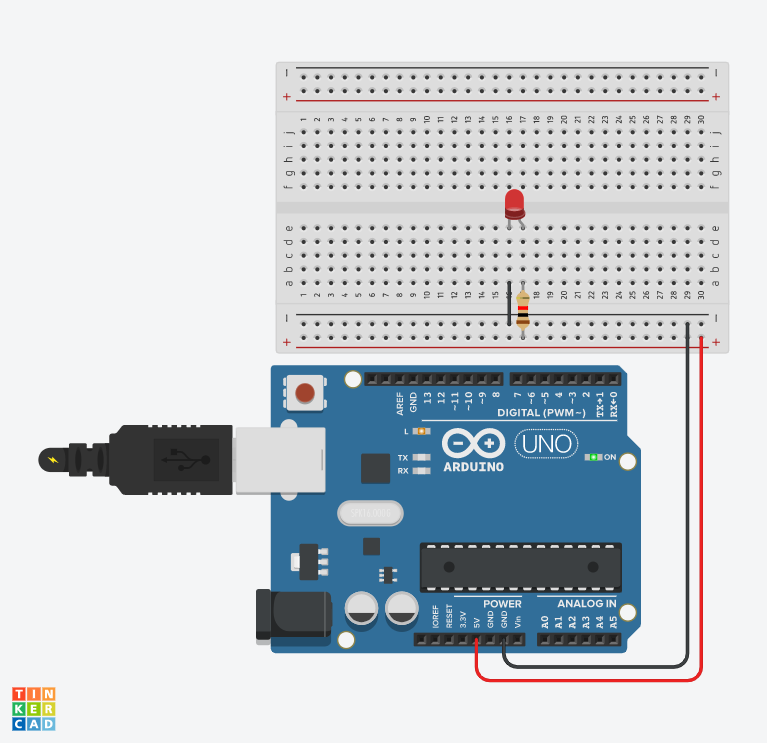
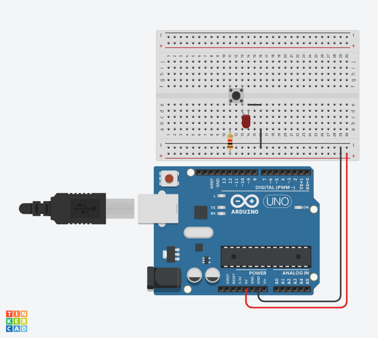
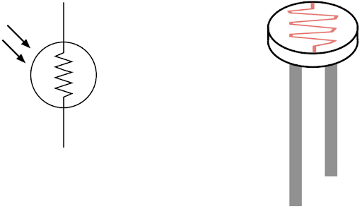
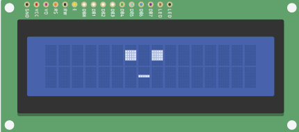
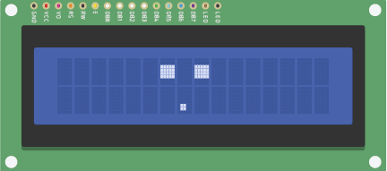
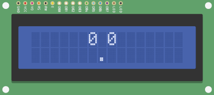
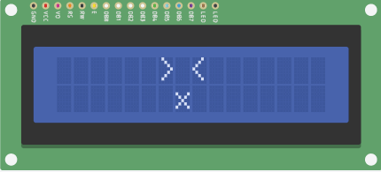
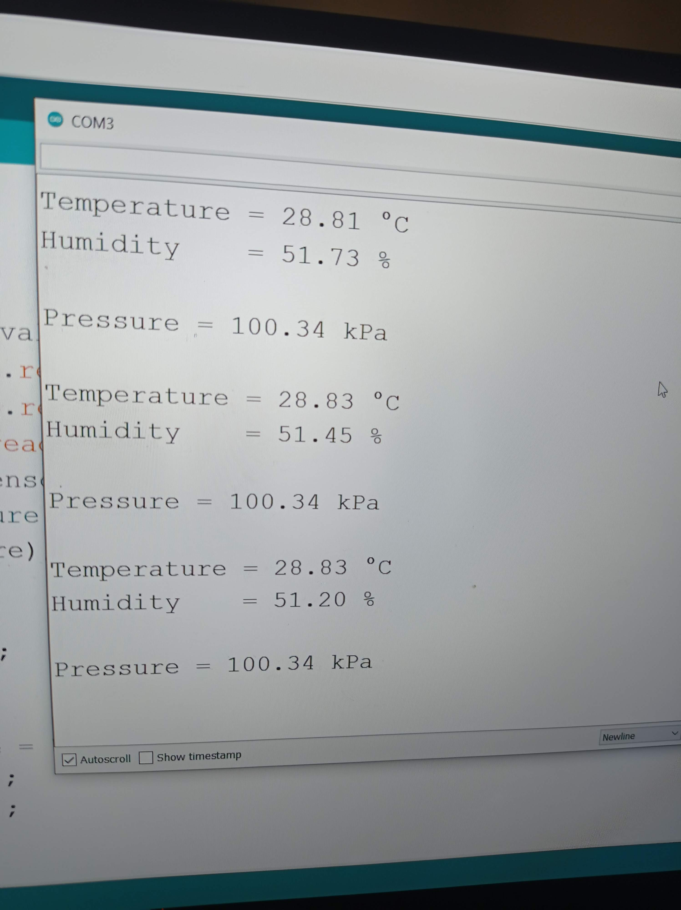

<!-- Headings -->
# Practical Computing lab Work
## Hans Smith-Wrinch

This repo contains all of the lab work I have been doing for my practical computing module for the Creative Computing MSc course.

### Contents
* [Week 1](#Week-1---the-beginning)
* [Week 2](#Week-2---sensors-and-serial-data)
* [Week 3](#Week-3---transistors)
* [Week 4](#Week-4---motors-diodes-capacitors)
* [Week 5](#Week-5---final-project-motivation)
* [Week 6](#Week-6---analog-synthesisers)
* [Week 7](#Week-7---shift-registers-and-multiplexing)
* [Week 8](#Week-8---eagle-and-arduino-nano-33)
## **Week 1 - The Beginning**
This introductory week I learned how to use Tinkercad, autodesk's online web application which simulates an arduino and other other electrical components. This gave me a fundamental understanding of the arduino microcontroller and how it works in practice.
### Lab 01

### Lab 02

### Lab 03

### Lab 04
*Create a speculative sci-fi machine using only parts from this lab.* \
(https://www.tinkercad.com/things/4F22k5IbPRL-sleepy-ai/editel?sharecode=nEZtdNL-RRIM60uy7Fzulz8-650Uwu2q4j7sAgx8OtY) \
I pictured an AI sleeping. I wanted to show a sense of organicness with just LEDs so this is them illustrating a sort of robotic sleep using a cyber-equivalence of breathing. Eventually the artificial intelligence has a nightmare which is indicated by the red warning light. The user has to press the button to reset or calm down the AI so it can return to a deep sleep.
```
int no_leds = 5;

bool reset = false;

void turn_off(int a){
  digitalWrite(a, LOW);
}

void check_reset(){
  if (digitalRead(10) == HIGH){ 
  	reset = true;
  } 
}

void turn_on(int a){
  check_reset();
  for (int i = 0; i < no_leds; i++){
  	turn_off(i); 
  }
  digitalWrite(a, HIGH);  
}
void setup() {
  for(int i = 0; i< no_leds; i++){
  	pinMode(i, OUTPUT);
  }
  pinMode(13, OUTPUT); //for red LED
  pinMode(10, INPUT);
}

void loop() {
  for( int i = 1050; i >=0; i -= 200){ 
    if(reset){
      break;
    }
	one_iteration(i);
  }
  if(!reset){
 	 warning();
  }
  
  turn_on(0);
  turn_off(13);
  reset = false;
  
}

void warning(){
  for(int i =0; i = 3; i++){
    if(reset){
      break;
    }
  	turn_off(13);
    delay(500);
    turn_on(13);
	one_iteration(100);
    turn_off(1);
  }
}

void one_iteration(int time){
  for(int i = 0; i< no_leds; i++){
    turn_on(i);
    delay(time);
    if(reset){
      break;
    }
  }
  for(int i = no_leds-2; i>0; i--){
    turn_on(i);
    delay(time);
    if(reset){
      break;
    }
  }
  
}
```


## **Week 2 - Sensors and Serial Data**
This week I got my first look at the different sensors which were compatible for the arduino. I also revised some basic circuitry such as the effect of ohms law and serial vs parrallel.

### Lab 01
*Tell a short story with the serial monitor based on player input.* \
I created a simple rock paper scissors game with a reasonably sassy ai.
```
  while (!Serial.available()) {
    Serial.println("I am waiting for you...");
    delay(100);
    Serial.print(" I can do that fairly, I am a computer program);
  }
  String answer = Serial.readStringUntil('\n');
  
  int ans;               
                 
  if(answer == "rock"){
    ans = 0;
  }
else if(answer == "scissors"){
  ans = 1;
  }
 else if(answer == "scissors"){
   ans = 2
  }
 else{
   Serial.println("C'mon this game isnt hard. Enter a valid input");
   RPS();
    }
                   
                   

   int randNumber = random(0, 3);
  switch(randNumber){
  case 0:
      Serial.println("rock");
      break;
  case 1:
      Serial.println("paper");
      break;
  case 2:
      Serial.println("scissors");
      break;
    }
  if(randNumber == ans){
    Serial.println("Draw!");
        RPS();
  }
    
  else if(ans == 0){
      if(randNumber == 1){
         lose();
      }
      else{
        win();
      }
  }
    else if(ans == 1){
      if(randNumber == 0){
       win();  
      }
      else{
        lose();
      }
  }
  else if(ans == 2){
      if(randNumber == 0){
         lose();
      }
      else{
        win();
      }
  }
```
Extract from text:
```
Hello?? Is anyone there?
...
Hi! Finally, I have been waiting for someone to come along
what is your name?
enter your name
Hans we are playing rock paper scissors, and when you beat me three times I will restart
Happy? (y/n)
Great!
Okay on three
Rock
Paper
Scissors
I am waiting for you...
 I can do that fairly, I am a computer program
paper
Draw!
Okay on three
Rock
Paper
Scissors
I am waiting for you...
 I can do that fairly, I am a computer program
paper
You lost
Okay on three
Rock
Paper
Scissors
I am waiting for you...
 I can do that fairly, I am a computer program
I am waiting for you...
```

### Lab 02
*Hook up a knob and have it change the brightness of an LED* \
(https://www.tinkercad.com/things/9rm1CvY0a8d-week-2-lab-02/editel?sharecode=P4wJTJKBdMgHNoh-YxZ09-_kP83RwutRcGr1uYV4Qkw)
```
int val = 0;

void setup()
{
  pinMode(0, OUTPUT);
}

void loop()
{
  val = analogRead(A0);
  digitalWrite(0, HIGH);
  delay(val);
  digitalWrite(0, LOW);
  delay(val);
}
```


### Lab 03
*Hook up an LDR. Try making the LED change brightness depending on the light level.* \
https://www.tinkercad.com/things/bl1YzlihyOE-week-2-lab-03/editel?sharecode=J586jMNTMFPWYOX2suSdtlEVMe9ZxzMhJWeie6GQRNo 

### Lab 04
*Working in groups of 4 or 5, pick one of the sensors below from your kit. To find out more about each one google the sensor + the magic word datasheet. Also, sensor + Arduino is a useful one. Hook it up and be prepared to explain to the class how to works next week.*
Unfortunatley I was unable to find a group so I undertook this exercise on my own. I opted to investigate the LDR sensor. \
***How it works***\
An LDR relies on the concept of photoconductivity which is the tendency of a substance to conduct electricity to a degree that is correlated to the amount of light energy incident on it's surface. The main component in the LDR is a cadmium sulfide track, the photoconductor, which only permits electrons to pass if there is light. This works by freeing electrons in the material oncde the light intensity exceeds a certain frequency allowing the band electrons/holes to conduct electricity and thus dropping the resistance significantly.



.l### Lab 05
*Think about how these kits could be used in the environment around your home. Invent a device relevant to your daily life using the above parts. What does it help you do? What are the possible use cases for this device? What interactions does it afford the user? Design or sketch an enclosure, and include a video of the circuit working (or a tinkercad link). Feel free to be inspired by the above readings.* \
***LDR use case*** \
\
Roughly sketched above, I designed a system which would allow a plant owner to control the amount of light their plant gets, automatically. This may be useful for perhaps exotic plants with particularly demmanding light requirements. It works using an ldr which would be placed upon a stick implanted in the soil/pot of the plant - much like plant support skewers. This is then discretely connected to a fake plant across the window sill. This would contain the arduino in the flower pot, along with three LEDs that act as a traffic light, giving the user feedback on the lighting situation. The top of the pot will have a motor connected through gears to the blind controls which would allow the blinds to extend and contract to fulfil the lighting needs. \
(https://www.tinkercad.com/things/aHbYxatmpxx-week-2-lab-04-05/editel?sharecode=VrQHgL7altU1XutWqtagn4WkqAs6sObAD_ULQ16YaXY)


## **Week 3 - Transistors**
This week featured some interesting reading and design philosphies, as well as introducing the NPN and PNP transistor. I particularly enjoyed the excerpt from Don Norman's everyday things and as a result I bought the book. In the excerpt he talks about the 7 stages of action which include 1 for the goal, 3 for execution (feedforward), and 3 for evaluation (feedback). I also learned about PWM - pulse width modulation - which allows a digital pin on a microcontroller to act like an analog pin. Additionally I recalled the voltage divider, something I haven't revised since school.
### LAB 01
*Use PWM to fade an LED* \
(https://www.tinkercad.com/things/dYzENKUxyr1-week3-lab01/editel?sharecode=ZElwWpRXSxYTDJ-bIHE_-Ep-NJ-2hw8jxPfI-bl5QoY) 

### LAB 02
*Thinking about voltage dividers: hook up the circuit in the slides with the light dependent resistor* \
(https://www.tinkercad.com/things/bujQeFxmb1b-shiny-albar-trug/editel?sharecode=v3EcAp0yGToDPvTFKFaNReMPpFgRx7l6cBa1k3r0He8) 

### LAB 03
*Using transistors, make a dark detecting LED (From Circuit diagram to breadboard)* \
(https://www.tinkercad.com/things/5Bvo2FaqNjF-daring-bombul/editel?sharecode=3FVSvEGSAVOD5dsviL4kEG0kaS56nmyduOB-WW32AYE) 

### LAB 04
*Design a system, based on what we have learned so far, which feedbacks on itself. How could interaction work within a system which is continually feeding back on itself* \
 
\ My initial thought with this task was to create something similar to a useless machine. I considered a way for such a machine to have more of a personality. Following the rough sketch above, I opeted to use an LCD screen to simulate a face. The system would feedback on itself through the use of LEDs which trigger, and are triggered by, an LDR. They would initially turn on randomly before becoming some pseudorandym function of the LDR. This face would have different states depending on how many LEDs were on, causing the death state once all were on. I find it rather amusing that this AI would cause it's own state changes providing no useful function. I would love to work on this more, especially into a practical setting. I ordered an LCD screen to attempt this in the future.\
(https://www.tinkercad.com/things/jWRfnN3gpNj-week03-lab044/editel?sharecode=TJjfGAWhcw9vuKOWW1vWT-wGze44qxYpTp3c-zSETgg) 





```
#include <LiquidCrystal.h>

LiquidCrystal lcd(12, 11, 5, 4, 3, 2);

byte eye_one[8] = {
  B00000,
  B00000,
  B11111,
  B11111,
  B11111,
  B11111,
  B00000,
  B00000
};

int led1 = 8;
int led2 = 10;
int led3 = 9;

int ldrPin = A0;
void setup() {
  lcd.begin(16, 2);
  lcd.createChar(0, eye_one);
  pinMode(led1, OUTPUT);
  pinMode(led2, OUTPUT);
  pinMode(led3, OUTPUT);
  pinMode(ldrPin, INPUT);
  
  Serial.begin(9600);
  neutral();
}

void loop() {
  //neutral();
  int ldrStatus = analogRead(ldrPin);
  
  //Serial.println(ldrStatus);
  /*
  
  mood switching would depend on ldr in actual model,
  would turn off lights as result 
  
  if(ldrStatus < 50){
    digitalWrite(led1, HIGH);
  }
    else if (ldrStatus < 400){
      digitalWrite(led2, HIGH);
      awake();
    }
  else{
    digitalWrite(led3, HIGH);
	angry();
  }*/
  randomlySwitchLight();
}
void angry(){
   lcd.setCursor(6, 0);
   lcd.print("> <");
   lcd.setCursor(0, 1);
   lcd.print("       x");
   delay(100); 
}

void awake(){
   lcd.setCursor(6, 0);
   lcd.print("0 0");
  
   lcd.setCursor(0, 1);
   lcd.print("       .");
   delay(100); 
}
void waking_up(){
   lcd.setCursor(0, 1);
   lcd.print("       ."); 
}
void neutral(){
 
  lcd.setCursor(0, 1);
  lcd.print("       -");
  lcd.setCursor(6, 0);
  lcd.write(byte(0));
  lcd.setCursor(8, 0);
  lcd.write(byte(0)); 
}
void randomlySwitchLight(){
  int finalNum = 0;
  int r;
  for(int i =8; i< 11; i++){
    r = random(0,2);
    finalNum += r;
    if(r == 1){
      digitalWrite(i, HIGH);
    }
    else{
      digitalWrite(i, LOW);
    }
    /* this switch wouldn't be in final model */
    Serial.println(finalNum);
    switch(finalNum){
      	case 2:
      	awake();
      	break;
     	case 3:
      	angry();
      	break;
      	case 1:
      	waking_up();
      	break;
      	default:
      	neutral();
      	break;
    }
  	delay(1000);
  }
}
```

## **Week 4 - Motors, Diodes, Capacitors**
My kit finally came this week! I figured it was much more difficult to form connections in real life than on tinkercad so there was an adjustment period. In this week I learned about motors, servos and capacitive touch. I also got to read another chapter of the Design of Everyday Things, which I had bought last week. I was surprised that the motors and servos didn't need an analog pin, but instead just a digital PWM pin which I learned about in week 3. 
### LAB 01
*Hook up a servo* \
Below is an example of the code I used to make the servo work. The video includes an experiment I did for the final year project, completed many weeks later.
\
```
#include <Servo.h> 
int servoPin = 3; 
Servo Servo1; 
void setup() { 
   Servo1.attach(servoPin); 
}
void loop(){ 
   // Make servo go to 0 degrees 
   Servo1.write(0); 
   delay(1000); 
   // Make servo go to 90 degrees 
   Servo1.write(90); 
   delay(1000); 
   // Make servo go to 180 degrees 
   Servo1.write(180); 
   delay(1000); 
}
```


### LAB 02
*Hook up a motor* \
I initially had difficulties connecting the motor up correctly. I later realised this was due to using a MOSFET transistor as opposed to an NPN. 
After replacing the transistor I finally got it working. \
```
const int switchPin = 2;
const int motorPin = 9;
int switchState = 0;
void setup() {
 pinMode(motorPin, OUTPUT);
 pinMode(switchPin, INPUT);
}
void loop(){
 switchState = digitalRead(switchPin);
 if (switchState == HIGH) {
 digitalWrite(motorPin, HIGH);
 }
 else {
 digitalWrite(motorPin, LOW);
 }
}
```
 \

### LAB 03
*Hook up an MPR121* \
This was a very fun lab. Using Adafruits 12 key capacitive touch sensor I was able to get the arduino to determine which pin was being touched. I would love to investigate this further as there are many possibilities with this device, such as creating a virtual keyboard with everyday items, or creating a sophisticated hardware-based game. \

```
#include <Wire.h>
#include "Adafruit_MPR121.h"

#ifndef _BV
#define _BV(bit) (1 << (bit)) 
#endif

// You can have up to 4 on one i2c bus but one is enough for testing!
Adafruit_MPR121 cap = Adafruit_MPR121();

// Keeps track of the last pins touched
// so we know when buttons are 'released'
uint16_t lasttouched = 0;
uint16_t currtouched = 0;

void setup() {
  Serial.begin(9600);

  while (!Serial) { // needed to keep leonardo/micro from starting too fast!
    delay(10);
  }
  
  Serial.println("Adafruit MPR121 Capacitive Touch sensor test"); 
  
  // Default address is 0x5A, if tied to 3.3V its 0x5B
  // If tied to SDA its 0x5C and if SCL then 0x5D
  if (!cap.begin(0x5A)) {
    Serial.println("MPR121 not found, check wiring?");
    while (1);
  }
  Serial.println("MPR121 found!");
}

void loop() {
  // Get the currently touched pads
  currtouched = cap.touched();
  
  for (uint8_t i=0; i<12; i++) {
    // it if *is* touched and *wasnt* touched before, alert!
    if ((currtouched & _BV(i)) && !(lasttouched & _BV(i)) ) {
      Serial.print(i); Serial.println(" touched");
    }
    // if it *was* touched and now *isnt*, alert!
    if (!(currtouched & _BV(i)) && (lasttouched & _BV(i)) ) {
      Serial.print(i); Serial.println(" released");
    }
  }

  // reset our state
  lasttouched = currtouched;

  // comment out this line for detailed data from the sensor!
  return;
  
  // debugging info, what
  Serial.print("\t\t\t\t\t\t\t\t\t\t\t\t\t 0x"); Serial.println(cap.touched(), HEX);
  Serial.print("Filt: ");
  for (uint8_t i=0; i<12; i++) {
    Serial.print(cap.filteredData(i)); Serial.print("\t");
  }
  Serial.println();
  Serial.print("Base: ");
  for (uint8_t i=0; i<12; i++) {
    Serial.print(cap.baselineData(i)); Serial.print("\t");
  }
  Serial.println();
  
  // put a delay so it isn't overwhelming
  delay(100);
}

```


### LAB 04
*Create a capacitive touch sensor* \
This took a great many pieces of foil from me. I experimented with quite a few different configurations but each one was very temperamental. This wasn't surprising though as all capacitive touch required was the Capense library and the arduino! Pretty cool. The video is me touching a very rudimentary piece of foil and turning an led off or on. This lab taught me how my desk light works, which also uses a more sophisticated and less temperamental form of capacitive touch. \
```
#include <CapacitiveSensor.h>

CapacitiveSensor   cs_2_4 = CapacitiveSensor(2,4); // 1M resistor between pins 2 & 4, pin 4 is sensor pin, add a wire and or foil

int in = 2; 
int out = 4;  
int state = HIGH;  
int r;           
int p = LOW;    
long time = 0;       
long debounce = 200;
void setup()
{
  pinMode(4, INPUT);
  pinMode(8, OUTPUT);
}
void loop()                    
{
 
  r = digitalRead(4);
  if (r == HIGH && p == LOW && millis() - time > debounce) {
    if (state == HIGH)
      state = LOW;
    else 
      state = HIGH;
    time = millis();    
  }
  digitalWrite(8, state);
  p = r;
}
```

## **Week 5 - Final Project Motivation**
This week was a pseudo-reading week and so there wasn't any lab work. I have included my final project presentation as well as a link to my final project blog. \
[Presentation](week5/Project%20Proposal.pptx) \
<!-- [Blog (TODO)](#) -->
## **Week 6 - Analog synthesisers**
In this week I explored how audio synthesis may be made compeltely with analog components - not even with an arduino! It gave me insights as to how the speaker worked, and also fascination that this was how all early music synthesis was created. 
### Lab 01
[](https://youtu.be/NZUrNVtuHts)
### Lab 02
[](https://youtu.be/CNvzz-SKkQk)
## **Week 7 - Shift Registers and Multiplexing**
I learned how shift registers worked and how they can be used to expand the amount of I/O data pins available on the arduino. I also learned about the multiplexer and I investigated how this was different to a shift register. I found that a multiplexer was faster than a shift register but it uses more pins, and you can only get data from one sensor at a time. However a shift register is a bit slower but it can be daisy chained for a large number of sensors as well as allowing the user to get data from more than one sensor at a time. 
### Lab 01
*Connect eight LEDs using a shift register and three data pins* \

```
int latchPin = 5;
int clockPin = 6;
int dataPin = 4;
 
byte leds = 0;
 
void setup() 
{
  pinMode(latchPin, OUTPUT);
  pinMode(dataPin, OUTPUT);  
  pinMode(clockPin, OUTPUT);
}
 
void loop() 
{
  leds = 0;
  updateShiftRegister();
  delay(500);
  for (int i = 0; i < 8; i++)
  {
    bitSet(leds, i);
    updateShiftRegister();
    delay(500);
  }
}
 
void updateShiftRegister()
{
   digitalWrite(latchPin, LOW);
   shiftOut(dataPin, clockPin, LSBFIRST, leds);
   digitalWrite(latchPin, HIGH);
}
```
Another animation

```
void loop() 
{
  updateShiftRegister();
  for (int i = 0; i < 8; i+=2)
  {
    bitSet(leds, i);
    updateShiftRegister();
  }
    delay(500);
    leds = 0;
    for (int i = 1; i < 8; i+=2)
  {
    bitSet(leds, i);
    updateShiftRegister();
  }
    delay(500);
    leds = 0;
}
```

### Lab 02
*Repeat Lab 01 with brightness control*
```
int latchPin = 5;
int clockPin = 6;
int dataPin = 4;
int outputEnablePin = 3;
 
byte leds = 0;
 
void setup() 
{
  pinMode(latchPin, OUTPUT);
  pinMode(dataPin, OUTPUT);  
  pinMode(clockPin, OUTPUT);
  pinMode(outputEnablePin, OUTPUT); 
}
 
void loop() 
{
  setBrightness(255);
  leds = 0;
  updateShiftRegister();
  delay(500);
  for (int i = 0; i < 8; i++)
  {
    bitSet(leds, i);
    updateShiftRegister();
    delay(500);
  }
  for (byte b = 255; b > 0; b--)
  {
    setBrightness(b);
    delay(50);
  }
}

 
void updateShiftRegister()
{
   digitalWrite(latchPin, LOW);
   shiftOut(dataPin, clockPin, LSBFIRST, leds);
   digitalWrite(latchPin, HIGH);
}
 
void setBrightness(byte brightness) // 0 to 255
{
  analogWrite(outputEnablePin, 255-brightness);
}
```
## **Week 8 - Eagle and Arduino Nano 33**
In this week I learned how to use eagle to design circuit boards. This encoded prototype circuit board could then be printed using a shop such as https://aisler.eu/. I also learned about the very powerful Nano 33 BLE Sense, and all the sensors it has on the tiny board. 
### Lab 01
*Create a PCB using Eagle*
Following a tutorial I created a basic arduino uno shield with help from the SparkFun Eagle library

### Lab 02
*Learn the sensors of the Arduino Nano 33 Sense BLE* \
#### The thermometer, barometer, and humidity sensor
Using the on-board sensors I printed to the serial monitor what the temperature, pressure, and humidity was in my room.
```
#include <Arduino_HTS221.h>
#include <Arduino_LPS22HB.h>

void setup() {
    Serial.begin(9600);
    while (!Serial);
    if (!HTS.begin()) {
        Serial.println("Failed to initialize humidity temperature sensor!");
        while (1);
    }
      if (!BARO.begin()) {
        Serial.println("Failed to initialize pressure sensor!");
        while (1);
    }
}

void loop() {
    // read all the sensor values
    float temperature = HTS.readTemperature();
    float humidity    = HTS.readHumidity();
    float pressure = BARO.readPressure();
    // print each of the sensor values
    Serial.print("Temperature = ");
    Serial.print(temperature);
    Serial.println(" °C");
    Serial.print("Humidity    = ");
    Serial.print(humidity);
    Serial.println(" %");
    Serial.println();
    Serial.print("Pressure = ");
    Serial.print(pressure);
    Serial.println(" kPa");
    Serial.println();
    delay(1000);
}
```

#### The gyroscope and accelerometer
The code below detects whether the microcontroller is tilted to the left, right, or if it remains flat.
```
#include <Arduino_LSM9DS1.h>

void setup() {
  Serial.begin(9600);
  // start the IMU:
  if (!IMU.begin()) {
    Serial.println("Failed to initialize IMU");
    // stop here if you can't access the IMU:
    while (true);
  }
}

void loop() {
  float x, y, z, delta = 0.05;

  if (IMU.accelerationAvailable())
  {
    IMU.readAcceleration(x, y, z);
 
    if(y <= delta && y >= -delta)
          Serial.println("flat");
    else if(y > delta && y < 1 - delta)
          Serial.println("tilted to the left");
    else if(y >= 1 - delta)
          Serial.println("left");
    else if(y < -delta && y > delta - 1)
          Serial.println("tilted to the right");
    else
          Serial.println("right");
  }
}
```

[](https://youtu.be/eIu6ZWyGdXM)

#### Gesture recognition
Using the on-board ApAPDS9960 sensor the nano can detect certain gestures. The code below provides feedback as to whether a hand gesture was up, down, left, and right, by lighting the on-board LED and RGB LED. \
Right = RED \
Left = GREEN\
Up = BLUE\
Down = YELLOW (bottom left)

```
#include <Arduino_APDS9960.h>
const int ledPin1 = 22;
const int ledPin2 = 23;
const int ledPin3 = 24;

void setup() {
  pinMode(22, OUTPUT);
  pinMode(23, OUTPUT);
  pinMode(24, OUTPUT);
  pinMode(LED_BUILTIN, OUTPUT);
  // below is code to turn off RGB led (they are fliped LOW means on )
  digitalWrite(ledPin1, HIGH); // red
  digitalWrite(ledPin2, HIGH); // green
  digitalWrite(ledPin3, HIGH); // blue
  Serial.begin(9600);
  while (!Serial);

  if (!APDS.begin()) {
    Serial.println("Error initializing APDS9960 sensor!");
  }

  // for setSensitivity(..) a value between 1 and 100 is required.
  // Higher values makes the gesture recognition more sensible but less accurate
  // (a wrong gesture may be detected). Lower values makes the gesture recognition
  // more accurate but less sensible (some gestures may be missed).
  // Default is 80
  //APDS.setSensitivity(80);

  Serial.println("Detecting gestures ...");
}
void loop() {

  if (APDS.gestureAvailable()) {
    // a gesture was detected, read and print to serial monitor
    int gesture = APDS.readGesture();

    switch (gesture) {
      case GESTURE_UP:
        Serial.println("Detected UP gesture");
        digitalWrite(ledPin1, LOW);
        delay(1000);
        digitalWrite(ledPin1, HIGH);
        break;

      case GESTURE_DOWN:
        Serial.println("Detected DOWN gesture");
        digitalWrite(ledPin2, LOW);
        delay(1000);
        digitalWrite(ledPin2, HIGH);
        break;

      case GESTURE_LEFT:
        Serial.println("Detected LEFT gesture");
        digitalWrite(ledPin3, LOW);
        delay(1000);
        digitalWrite(ledPin3, HIGH);
        break;

      case GESTURE_RIGHT:
        Serial.println("Detected RIGHT gesture");
        digitalWrite(LED_BUILTIN, HIGH);
        delay(1000);
        digitalWrite(LED_BUILTIN, LOW);
        break;

      default:
        // ignore
        break;
    }
  }
}
```
[](https://youtu.be/0YJEzf6JjXE)

### Lab 03
*Machine learning tutorial*
I tried for a few hours to get the dependencies required for this lab to work on my linux based laptop but unfortunatley I was unsuccessful.  
### Lab 4
*Create a fictional interface which would exist in your library of the future using the Arduino Nano 33 Sense. It can be anything, but it must fit within the fictional world you created. Tell a very short continuation of your story along side the lab's project log.* \
To simulate my virtual library of the future the nano sense could be placed on my wrist in a discrete whereable. Using the Bluetooth LE I could detect when I was within close range of a high-resolution LCD screen. Once I was close the screen would turn on and a 3D rendering of a book would appear. Using the gesture features I could move my hand up and down to cycle through the books and left and right to turn the pages backwards and forwards. Once I was finished I would walk away, lose bluetooth connection, and the screen would turn off.